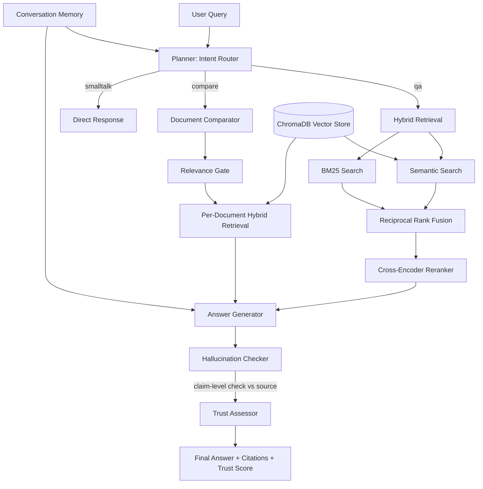

# AI Knowledge Assistant

A multi-agent, agentic RAG (Retrieval-Augmented Generation) system that answers questions over your documents with hybrid retrieval, hallucination detection, and trust scoring — built entirely on free-tier infrastructure.

### 🔗 [Try it live →](https://ragproject-mpe2woeun7h2fezdvkdcnb.streamlit.app/)

No installation needed — upload a PDF and start asking questions.

---

## What it does

Upload PDF documents and ask questions about them. The system doesn't just retrieve and answer — it independently checks whether its own answer is actually supported by the source material, and tells you how much to trust the response.

- **Hybrid retrieval** — combines semantic (vector) search and keyword (BM25) search via Reciprocal Rank Fusion, then re-ranks with a cross-encoder for precision
- **Hallucination detection** — every answer is broken into individual claims and independently fact-checked against the retrieved source text by a separate, stronger judge model
- **Trust scoring** — combines retrieval confidence and hallucination results into a single trust signal (high / medium / low) shown to the user
- **Document comparison** — compares how two different documents discuss the same topic, with a relevance gate to avoid comparing unrelated content
- **Intent routing** — an LLM-driven planner classifies each query (question-answering / document comparison / small talk) and routes it accordingly
- **Conversational memory** — session-isolated memory with pronoun resolution, so follow-up questions like "what about the second one?" work correctly

---

## Architecture



---

## Tech Stack

| Component | Technology |
|---|---|
| LLM (generation) | Groq — `llama-3.1-8b-instant` |
| LLM (judge/verifier) | Groq — `llama-3.3-70b-versatile` |
| Embeddings | `sentence-transformers/all-MiniLM-L6-v2` |
| Vector store | ChromaDB |
| Keyword search | BM25 (`rank_bm25`) |
| Reranking | Cross-encoder |
| Backend | FastAPI |
| Frontend | Streamlit |
| PDF parsing | PyMuPDF (`fitz`) |

Runs entirely on free-tier APIs — no paid infrastructure, developed and tested on a CPU-only laptop (AMD Ryzen 3, 8GB RAM).

---

## Evaluation

Rather than assuming the architecture choices (hybrid search, reranking) actually improve results, I built a benchmark framework to measure it directly.

**Benchmark:** 56 question-answer pairs, semi-automatically generated (LLM-assisted, human spot-checked) from 6 source documents across 3 subjects (compiler design, computer networks, NLP) — chosen to test retrieval across genuinely different domains, not just one subject repeated.

**Metrics measured per pipeline variant:**
- **Answer Accuracy** — LLM-as-judge comparison against expected answers
- **Faithfulness** — claim-level grounding check (reuses the production hallucination checker)
- **Context Precision (MRR)** — how highly the correct source chunk ranked in retrieval
- **Retrieval Recall@1/3/5** — whether the correct chunk was found within the top-K results
- **Latency** — end-to-end time per query

**Results (56 questions, 4 pipeline variants):**

| Variant | Accuracy | Faithfulness | Precision (MRR) | Recall@1 | Recall@3 | Recall@5 |
|---|---|---|---|---|---|---|
| Vector-only | 98.3% | 93.3% | 0.652 | 50.0% | 76.7% | 83.3% |
| BM25-only | 98.3% | 100.0% | 0.504 | 33.3% | 66.7% | 70.0% |
| Hybrid | 96.7% | 90.9% | 0.619 | 46.7% | 70.0% | 83.3% |
| **Hybrid + Reranker** | **100.0%** | **91.1%** | **0.771** | **64.3%** | **91.1%** | **91.1%** |

**Takeaway:** Hybrid+Reranker wins decisively across the board — best answer accuracy, best retrieval precision (MRR), and the highest recall at every cutoff (91.1% chance the correct source is in the top 3 results, vs 67-77% for the simpler methods), while faithfulness stays consistent with the other variants (~91%). BM25-only shows the opposite pattern worth noting — perfect faithfulness (100%) but the weakest retrieval — a useful illustration that "faithful to retrieved context" and "retrieved the right context" are two different things worth measuring separately. Hybrid+Reranker is the pipeline used in production.

---

## Engineering Notes

- **Groq free-tier daily token limit (100k tokens/day on the 70b judge model):** running the full evaluation (56 questions × 4 pipeline variants × 2 LLM-judge calls each) exceeded the daily quota partway through the first full run, breaking faithfulness results for the last-tested variant. Diagnosed from the actual API error rather than guessing, then fixed two ways: moved the simpler accuracy-grading task to a smaller model to reduce load on the daily-limited model, and added the ability to re-run a single pipeline variant in isolation — so the affected variant was re-measured the next day without repeating the full comparison.
- **Corrupted / image-only PDFs:** discovered that PDF corruption can be introduced by opening binary files directly in a text-oriented editor; also found that some "text-looking" PDFs are actually rendered as flattened images with no extractable text layer at all (confirmed via character-count checks, not assumption).
- **PPT-derived PDF noise:** slide-converted PDFs introduced stray control characters and thin/low-content pages (title slides, link-only slides); handled with a general control-character stripping function and a minimum-word-count filter, rather than patching each symptom individually.

---

## Known Limitations / Future Work

- **Scanned/image-only PDFs are not supported** — no OCR step currently. Identified as a clear extension point, scoped out of this iteration.
- **Single-language (English) support only**
- **YouTube/web article ingestion** — not yet implemented; would extend the existing loader pattern to new source types with the retrieval/generation pipeline unchanged
- **Deployment**: currently on Streamlit Community Cloud (merged single-app version); Render deployment was attempted but hit the platform's 512MB memory limit against the embedding model's ~1-2GB requirement

---

## Running Locally

The live demo above is the easiest way to try this. If you want to run it yourself or read through the code locally:

```bash
git clone <repo-url>
cd RAG_Project
pip install -r requirements.txt
```

Create a `.env` file:
```
GROQ_API_KEY=your_key_here
```

Ingest documents:
```bash
python ingest_documents.py data/uploaded_docs/your_file.pdf
```

Run locally:
```bash
streamlit run streamlit_app.py
```

---

## Author

Akshay — B.Tech CSE (Data Science), Vishwakarma Institute of Information Technology, Pune
